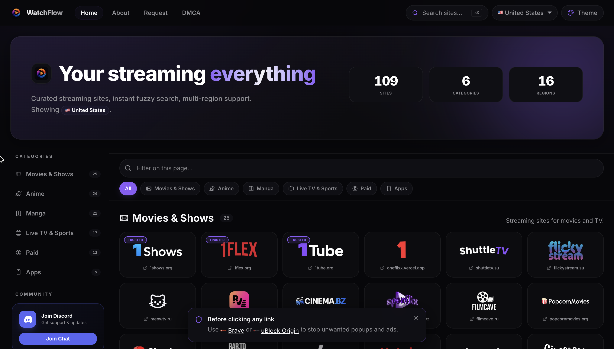

  

# 
WatchFlow

  A curated, regional index of free streaming sites.

  

## Features

- **Modern SaaS UI**: Overhauled aesthetics inspired by Linear and Apple (dark mode, glassmorphism, responsive animations).
- **Favorites Bar**: Star your favorite links and save them locally.
- **Raycast-like Command Search**: Use shortcuts (`Ctrl+K` or `Cmd+K`) to quickly filter and open sites.
- **Responsive Layout**: Designed for all screen sizes from mobile to desktop.
- **Discord Request Integrations**: Direct hook submissions for suggestions.

## How to add a new site?

Fork the repository, make your additions in `public/Region-Links/`, and submit a pull request!

## Socials

Join our community on [Discord](https://discord.gg/5YuWjScVT).

## License

[MIT](LICENSE)